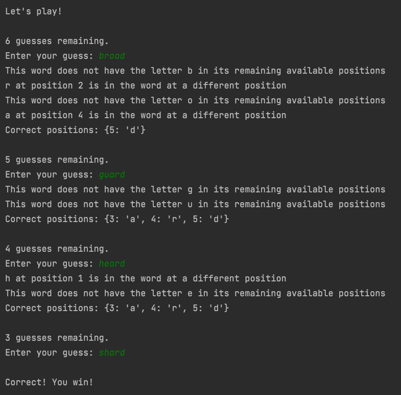

### Wordle in Python

This is a quick Python implementation of the game "Wordle" in text form.

- Play wordle at: https://www.powerlanguage.co.uk/wordle/
- I received the list of 5-letter words from https://github.com/charlesreid1/five-letter-words/blob/master/sgb-words.txt
